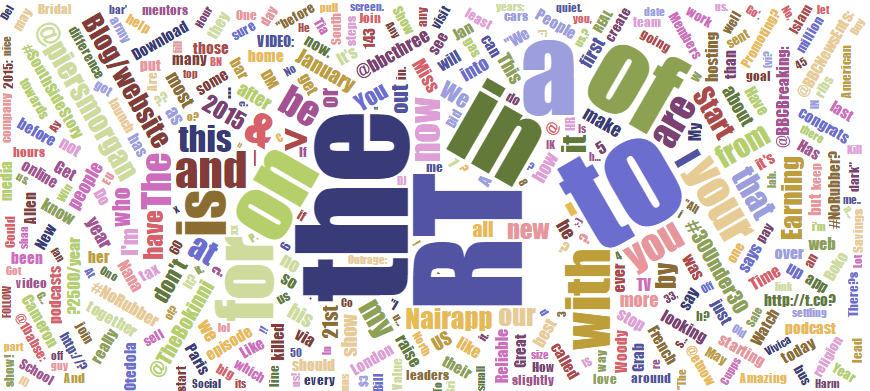

TweetCloud is a web application for organising  tweets  using  visualisation. For  people  who  follow  hundreds, sometimes it might be nice to just get a summary of what everyone is talking about.  TweetCloud extracts all  tweets/re-tweets on your twitter timeline and renders this in an aesthetic tag  cloud!

TweetCloud is built on Google App Engine and utilizes Google technologies for data processing and storage such as cron jobs, mapReduces, and datastore.

